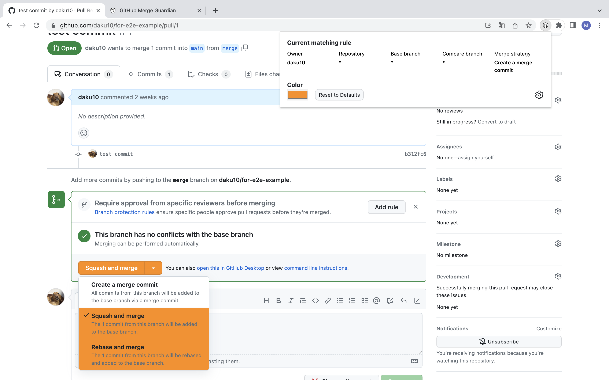
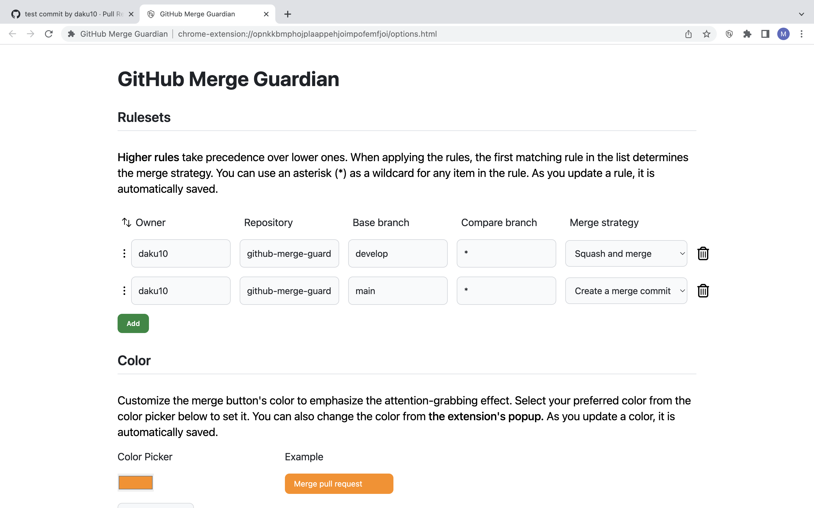

# GitHub Merge Guardian

GitHub Merge Guardian is a browser extension that helps to prevent incorrect merges on GitHub Pull Request pages by changing the merge button color.

## Features

- Configure multiple rules based on owner, repository name, base branch, compare branch, and merge strategy.
- Use * as a wildcard in each item.
- Change the merge button color to draw attention when the merge strategy doesn't match the configured rules.
- Merge button color change only indicates the suggestion; you can still perform other merge strategies if needed.
- Customize the merge button color.

## Install

- [Google Chrome](https://chrome.google.com/webstore/detail/github-merge-guardian/lnnbjejjanhgjakiobppbbchlgbbglio)
- Firefox: TODO

## How to use

1. Click the extension icon in the toolbar to access the popup settings.
2. Add rules based on owner, repository name, base branch, compare branch, and merge strategy.
3. Customize the merge button color if desired.

## Example

- Use squash merge for merging into the develop branch, but use create merge commit for merges from release/* branches.

By using GitHub Merge Guardian, you can easily control the merge strategies of your pull requests. Add your custom rules to apply the appropriate merge strategy depending on the repository and branch combination.

## Screenshots

### How the extension works

### Option page

## Disclaimer

This extension is not affiliated with, sponsored by, or endorsed by GitHub, Inc.

## License

This project is licensed under the MIT License. See the [LICENSE](LICENSE) file for details.
